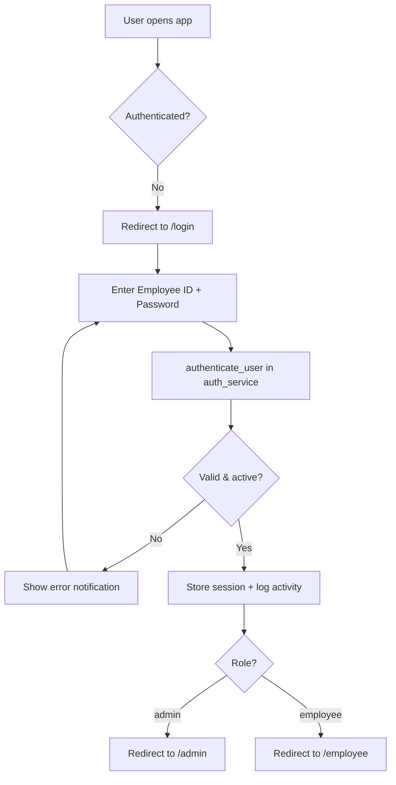
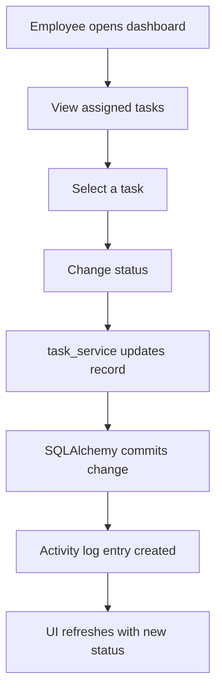
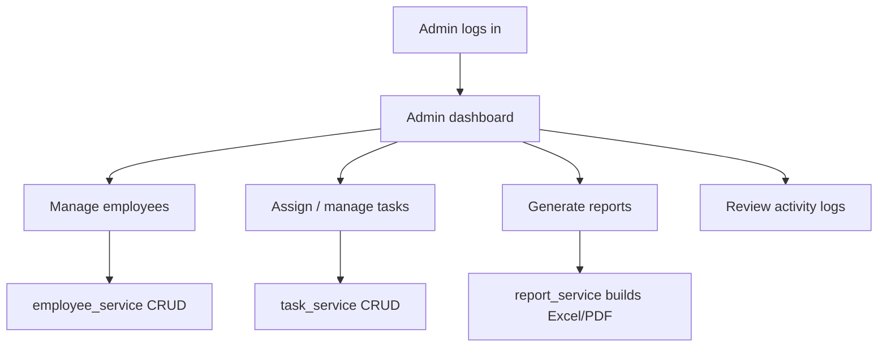
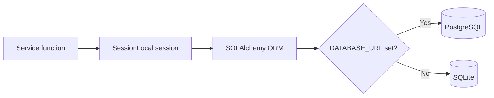
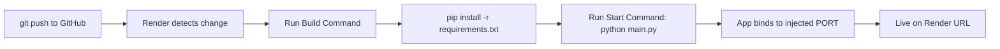

<div align="center">

# 🚀 TaskFlow – Employee Task Management System

**A role-based, production-ready employee task management platform built with Python & NiceGUI.**

TaskFlow lets administrators manage employees and monitor daily work, while employees submit and update their assigned tasks — all behind secure, session-based, role-aware authentication. It ships ready for one-click deployment to Render straight from GitHub.

<br />


</div>

---

## 📑 Table of Contents

1. [Project Overview](#-1-project-overview)
2. [Key Features](#-2-key-features)
3. [Technology Stack](#-3-technology-stack)
4. [System Architecture](#-4-system-architecture)
5. [Folder Structure](#-5-folder-structure)
6. [Database Design](#-6-database-design)
7. [User Roles](#-7-user-roles)
8. [Application Workflow](#-8-application-workflow)
9. [Screenshots](#-9-screenshots)
10. [Installation Guide](#-10-installation-guide)
11. [Environment Variables](#-11-environment-variables)
12. [Default Login Credentials](#-12-default-login-credentials)
13. [Git Commands](#-13-git-commands)
14. [Deployment Guide](#-14-deployment-guide)
15. [Security](#-15-security)
16. [Future Improvements](#-16-future-improvements)
17. [Developer Guide](#-17-developer-guide)
18. [FAQ](#-18-faq)
19. [Troubleshooting](#-19-troubleshooting)
20. [License](#-20-license)
21. [Contributing](#-21-contributing)
22. [Contact](#-22-contact)
23. [Acknowledgements](#-23-acknowledgements)

---

## 🧭 1. Project Overview

### Purpose
TaskFlow is a **role-based employee task management web application** that centralizes how organizations assign, track, and report on daily work. It provides two distinct portals — one for administrators and one for employees — behind a single, secure login.

### Problem Statement
Small and mid-sized teams frequently manage tasks through scattered spreadsheets, chat messages, and email threads. This leads to:

- ❌ No single source of truth for who is doing what.
- ❌ No audit trail of status changes or user actions.
- ❌ No structured reporting for management review.
- ❌ Weak or non-existent access control between roles.

TaskFlow solves these problems with a structured, auditable, role-aware system backed by a relational database.

### Objectives
- ✅ Provide a clean separation between **administrator** and **employee** capabilities.
- ✅ Track tasks through a well-defined lifecycle of statuses.
- ✅ Maintain an **activity log** for accountability.
- ✅ Offer **Excel and PDF reporting** for management.
- ✅ Remain **portable** — SQLite locally, PostgreSQL in production, with zero code changes.
- ✅ Support **continuous deployment** to Render directly from GitHub.

### Who Will Use It
| User | Use Case |
|------|----------|
| 👔 **Administrators / Managers** | Create and manage employees, assign work, monitor progress, export reports. |
| 👤 **Employees** | View assigned tasks and update their status throughout the day. |
| 🛠️ **Developers** | Extend the layered codebase with new pages, services, and models. |

### Benefits
- **Layered architecture** keeps presentation, business logic, and data access cleanly separated.
- **Self-seeding database** — tables and a default admin account are created automatically on first run.
- **Secure by default** — hashed passwords, signed sessions, and middleware-enforced role checks.
- **Deployment-ready** — includes `render.yaml`, `Procfile`, and environment-driven configuration.

---

## ⭐ 2. Key Features

<details open>
<summary><strong>👔 Admin Features</strong></summary>

- Create, edit, deactivate, and delete employee accounts.
- Assign tasks to employees and monitor their status.
- View organization-wide dashboards and metrics.
- Generate and export **Excel** and **PDF** reports.
- Review the system-wide **activity log**.

</details>

<details open>
<summary><strong>👤 Employee Features</strong></summary>

- Secure personal login.
- View all tasks assigned to them.
- Update task status: *Pending → Work In Progress → Completed* (or *Blocked* / *On Hold*).
- Change their own password securely.

</details>

<details>
<summary><strong>🔐 Security Features</strong></summary>

- Werkzeug **scrypt** password hashing (passwords are never stored in plaintext).
- Session-based authentication with a signed session cookie.
- **Role-Based Access Control (RBAC)** enforced by ASGI middleware.
- Environment-driven secrets (no credentials committed to source control).

</details>

<details>
<summary><strong>📊 Reporting & Logging</strong></summary>

- **Reporting:** Export task and employee data to Excel (`openpyxl`) and PDF (`reportlab`).
- **Activity Logs:** Every significant action (logins, password changes, and more) is recorded in an audit trail.
- **Application Logging:** Console + rotating file logs for observability.

</details>

<details>
<summary><strong>🎨 Experience & Operations</strong></summary>

- Responsive, corporate teal design system with a fixed sidebar and light-themed cards.
- Branded **403 / 404 / 500** error pages.
- **Deployment-ready** with `render.yaml` and `Procfile`.

</details>

---

## 🧱 3. Technology Stack

| Layer | Technology |
|-------|------------|
| **Frontend / UI** | NiceGUI (Python-defined UI, Quasar/Vue under the hood), custom CSS, Remix Icon |
| **Backend** | Python 3.12, NiceGUI on FastAPI · Starlette · Uvicorn (ASGI) |
| **Database (Dev)** | SQLite |
| **Database (Prod)** | PostgreSQL (via `DATABASE_URL`) |
| **ORM** | SQLAlchemy 2.x |
| **Authentication** | Session-based auth + Role-Based Access Control |
| **Password Security** | Werkzeug password hashing (scrypt) |
| **Reporting** | openpyxl (Excel), reportlab (PDF) |
| **Configuration** | python-dotenv |
| **Deployment** | Render (Blueprint via `render.yaml`) |
| **Hosting** | Render Web Service |
| **Production Server** | `python main.py` (NiceGUI + bundled Uvicorn); optional Gunicorn + Uvicorn worker |
| **Version Control** | Git + GitHub |
| **Development Tools** | Virtualenv, pip, VS Code |

---

## 🏗️ 4. System Architecture

TaskFlow follows a **layered architecture**. Each request flows top-to-bottom through clearly separated responsibilities:

```
                    ┌─────────────────────┐
                    │       Browser        │   User interacts with the UI
                    └──────────┬──────────┘
                               │  HTTP / WebSocket
                               ▼
                    ┌─────────────────────┐
                    │       NiceGUI        │   ASGI app (FastAPI · Starlette · Uvicorn)
                    └──────────┬──────────┘
                               │
                               ▼
                    ┌─────────────────────┐
                    │  Auth Middleware     │   Authentication + Role-Based Access Control
                    └──────────┬──────────┘
                               │
                               ▼
                    ┌─────────────────────┐
                    │        Pages         │   Presentation layer (login, admin, employee, reports)
                    └──────────┬──────────┘
                               │
                               ▼
                    ┌─────────────────────┐
                    │       Services       │   Business logic (auth, employees, tasks, reports)
                    └──────────┬──────────┘
                               │
                               ▼
                    ┌─────────────────────┐
                    │    SQLAlchemy ORM    │   Data access layer (models + sessions)
                    └──────────┬──────────┘
                               │
                               ▼
                    ┌─────────────────────┐
                    │ SQLite / PostgreSQL  │   Persistence layer
                    └─────────────────────┘
```

### Layer Responsibilities

| Layer | Responsibility |
|-------|----------------|
| **Browser** | Renders the NiceGUI-generated interface and communicates over HTTP and a WebSocket channel. |
| **NiceGUI** | The ASGI application. Builds the UI in Python and routes requests through FastAPI/Starlette, served by Uvicorn. |
| **Auth Middleware** | Intercepts every request. Redirects unauthenticated users to `/login` and enforces role boundaries (employees cannot reach `/admin`, admins cannot reach `/employee`). |
| **Pages** | The presentation layer. Each module (`login`, `admin`, `employee`, `reports`) defines routes and UI components. |
| **Services** | The business logic layer. Pure, reusable functions that authenticate users, manage employees/tasks, and build reports — independent of the UI. |
| **SQLAlchemy ORM** | Maps Python classes to database tables and manages sessions/transactions. |
| **SQLite / PostgreSQL** | The persistence layer. Chosen automatically based on the `DATABASE_URL` environment variable. |

---

## 📁 5. Folder Structure

```
Employee-Task-Management-System/
│
├── main.py                 # Entry point: DB init, middleware, route registration, server startup
├── config.py               # Environment-driven configuration (dev/prod, DB URL, secrets, port)
├── requirements.txt        # Python dependencies
├── Procfile                # Process definition for platforms that read it (web: python main.py)
├── render.yaml             # Render Blueprint for automatic deployment
├── .python-version         # Pins Python 3.12 on Render
├── .env.example            # Sample environment variables (copy to .env)
├── .gitignore              # Ignore rules (secrets, venv, DB, logs, caches)
│
├── models/                 # Data layer — SQLAlchemy models + engine/session factory
│   ├── __init__.py         #   Engine (SQLite/PostgreSQL aware), SessionLocal, Base, get_db()
│   ├── employee.py         #   Employee model
│   ├── task.py             #   Task model
│   └── activity_log.py     #   ActivityLog model
│
├── pages/                  # Presentation layer — NiceGUI page definitions (the UI)
│   ├── login.py            #   Login page & authentication UI
│   ├── admin.py            #   Admin dashboard, employee & task management
│   ├── employee.py         #   Employee dashboard & task updates
│   ├── reports.py          #   Reporting & export pages
│   └── layout.py           #   Shared sidebar layout wrapper
│
├── services/               # Business logic layer — reusable, framework-agnostic
│   ├── auth_service.py     #   Hashing, authentication, password change, activity logging
│   ├── employee_service.py #   Employee CRUD operations
│   ├── task_service.py     #   Task CRUD & status transitions
│   └── report_service.py   #   Excel/PDF report generation
│
├── utils/                  # Cross-cutting helpers
│   ├── logging_config.py   #   Console + rotating file logging
│   └── error_pages.py      #   Branded 403 / 404 / 500 handlers
│
├── static/                 # Static assets
│   └── css/custom.css      #   Design system & component styling
│
├── database/               # Local SQLite database (git-ignored)
└── logs/                   # Application log files (git-ignored)
```

### Folder Responsibilities

| Folder | Description |
|--------|-------------|
| `models/` | Defines the database schema using SQLAlchemy and configures the engine/session. |
| `pages/` | Contains the user-facing UI. Each file registers one or more NiceGUI routes. |
| `services/` | Encapsulates business rules so they can be reused and tested independently of the UI. |
| `utils/` | Shared utilities (logging and error pages) used across the application. |
| `static/` | CSS and static files served under `/static`. |
| `database/` | Holds the local SQLite file during development (ignored by Git). |
| `logs/` | Stores rotating application logs (ignored by Git). |

---

## 🗄️ 6. Database Design

TaskFlow uses three related tables managed through SQLAlchemy.

### 👤 `employees` Table

| Column | Type | Constraints | Description |
|--------|------|-------------|-------------|
| `employee_id` | String(50) | **Primary Key** | Unique employee identifier (also the login ID). |
| `employee_name` | String(100) | Not Null | Full name. |
| `phone_number` | String(20) | Not Null | Contact number. |
| `password_hash` | String(255) | Not Null | Scrypt-hashed password. |
| `role` | String(20) | Not Null, default `employee` | `admin` or `employee`. |
| `department` | String(100) | Nullable | Department name. |
| `status` | String(20) | Not Null, default `active` | `active` or `inactive`. |
| `joining_date` | Date | Not Null | Date the employee joined. |
| `created_at` | DateTime | Server default `now()` | Record creation timestamp. |
| `updated_at` | DateTime | Auto-updates | Last modification timestamp. |

### ✅ `tasks` Table

| Column | Type | Constraints | Description |
|--------|------|-------------|-------------|
| `task_id` | Integer | **Primary Key**, autoincrement | Unique task ID. |
| `employee_id` | String(50) | **Foreign Key → employees.employee_id** | Owner of the task. |
| `title` | String(200) | Not Null | Task title. |
| `description` | Text | Nullable | Detailed description. |
| `status` | String(50) | Not Null, default `Pending` | Lifecycle status (see below). |
| `created_date` | Date | Default current date | Date created. |
| `created_time` | Time | Default current time | Time created. |
| `updated_time` | Time | Auto-updates | Time last updated. |
| `last_modified` | DateTime | Auto-updates | Last modification timestamp. |

**Task Status Values:** `Pending` · `Work In Progress` · `Completed` · `Blocked` · `On Hold`

### 📝 `activity_logs` Table

| Column | Type | Constraints | Description |
|--------|------|-------------|-------------|
| `log_id` | Integer | **Primary Key**, autoincrement | Unique log entry ID. |
| `employee_id` | String(50) | **Foreign Key → employees.employee_id**, nullable | Actor (nullable for system events). |
| `action` | String(255) | Not Null | Human-readable action description. |
| `created_at` | DateTime | Server default `now()` | When the action occurred. |

### 🔗 Relationships

```
┌──────────────┐          1        ┌──────────────┐
│  employees   │───────────────────│    tasks     │
│              │        owns  *     │              │
│ employee_id  │◄──────────────────│ employee_id  │
└──────┬───────┘                   └──────────────┘
       │ 1
       │ generates
       │ *
       ▼
┌──────────────┐
│ activity_logs│
│ employee_id  │
└──────────────┘
```

- One **Employee** has many **Tasks** (`one-to-many`, `cascade="all, delete-orphan"`).
- One **Employee** has many **Activity Logs** (`one-to-many`, `cascade="all, delete-orphan"`).
- Deleting an employee cascades to their tasks and logs.

---

## 👥 7. User Roles

TaskFlow enforces two roles. Access is controlled by `AuthMiddleware`, which inspects the authenticated session on every request.

### 👔 Admin

| Permission | Allowed |
|------------|:-------:|
| Access the `/admin` portal | ✅ |
| Create / edit / delete employees | ✅ |
| Assign and manage tasks | ✅ |
| View all tasks and dashboards | ✅ |
| Generate Excel / PDF reports | ✅ |
| View the activity log | ✅ |
| Access the `/employee` portal | ❌ (redirected to `/admin`) |

### 👤 Employee

| Permission | Allowed |
|------------|:-------:|
| Access the `/employee` portal | ✅ |
| View their own assigned tasks | ✅ |
| Update the status of their tasks | ✅ |
| Change their own password | ✅ |
| Access the `/admin` portal | ❌ (redirected to `/employee`) |
| Manage other employees | ❌ |

---

## 🔄 8. Application Workflow

### 🔑 Login Flow



### ✅ Task Submission / Update Flow



### 👔 Admin Flow



### 🗄️ Database Flow



### 🚀 Deployment Flow



---

## 🖼️ 9. Screenshots

> 📸 The images below are placeholders. Add your screenshots to `docs/screenshots/` and they will render automatically.

| View | Preview |
|------|---------|
| 🔐 **Login** | `` |
| 👔 **Admin Dashboard** | `` |
| 👤 **Employee Dashboard** | `` |
| ✅ **Task Management** | `` |
| 📊 **Reports** | `` |
| ⚙️ **Profile** | `` |

---

## ⚙️ 10. Installation Guide

### Prerequisites
- Python **3.12+**
- Git

### Step 1 — Clone the Repository
```bash
git clone https://github.com/<username>/taskflow.git
cd taskflow
```

### Step 2 — Create a Virtual Environment
A virtual environment isolates this project's dependencies from your system Python.

```bash
# Create it
python -m venv venv

# Activate it
source venv/bin/activate       # macOS / Linux
venv\Scripts\activate          # Windows (PowerShell / CMD)
```
Your prompt shows `(venv)` when active. Exit any time with `deactivate`.

### Step 3 — Install Dependencies
```bash
pip install -r requirements.txt
```

### Step 4 — Configure Environment Variables
```bash
cp .env.example .env
```
Open `.env` and set at least a strong `STORAGE_SECRET`. Generate one with:
```bash
python -c "import secrets; print(secrets.token_hex(32))"
```

### Step 5 — Run the Project
```bash
python main.py
```
Open **http://localhost:8080** in your browser.

On first run, TaskFlow automatically:
1. Creates the `database/` folder and SQLite file.
2. Creates all tables.
3. Seeds the default administrator account.

---

## 🔧 11. Environment Variables

| Variable | Required | Default | Description |
|----------|:--------:|---------|-------------|
| `STORAGE_SECRET` | Production | dev fallback | Signs session cookies (NiceGUI's equivalent of Flask's `SECRET_KEY`). Use a long random string. `SECRET_KEY` is accepted as an alias. |
| `DATABASE_URL` | No | local SQLite | Full database connection string. When set (e.g. PostgreSQL), it is used automatically; `postgres://` is normalized to `postgresql://`. |
| `ENVIRONMENT` | No | auto-detected | `development` or `production`. Render is auto-detected via the `RENDER` variable. |
| `PORT` | No | `8080` | Port the server binds to. Render injects this automatically. |
| `HOST` | No | `0.0.0.0` | Network interface to bind. |
| `LOG_LEVEL` | No | `INFO` (prod) / `DEBUG` (dev) | Logging verbosity: `DEBUG`, `INFO`, `WARNING`, `ERROR`. |
| `DEFAULT_ADMIN_ID` | No | `admin` | Employee ID for the seeded admin (used only on an empty database). |
| `DEFAULT_ADMIN_PASSWORD` | No | `Admin@123` | Password for the seeded admin (used only on an empty database). |

---

## 🔑 12. Default Login Credentials

When the database is empty, TaskFlow seeds a default administrator so you can log in immediately.

> ⚠️ **Security Notice:** Change the default admin password immediately after your first login, and override the defaults with environment variables in production.

### 👔 Admin
| Field | Value |
|-------|-------|
| **Employee ID** | `admin` |
| **Password** | `Admin@123` |

### 👤 Employees
Employees **do not self-register**. To create an employee account:

1. Log in as the administrator.
2. Open the **Employee Management** section of the admin portal.
3. Create a new employee with an Employee ID, name, and password.
4. Share those credentials with the employee, who can then log in to their own portal.

---

## 🐙 13. Git Commands

Every command below, explained:

```bash
git init
```
> Initializes a new, empty Git repository in the current folder.

```bash
git status
```
> Shows which files are staged, modified, or untracked — run it often to see the current state.

```bash
git add .
```
> Stages **all** changes (respecting `.gitignore`) for the next commit.

```bash
git commit -m "Initial commit"
```
> Records the staged changes as a permanent snapshot with a descriptive message.

```bash
git branch -M main
```
> Renames the current branch to `main` (the modern default); `-M` forces the rename.

```bash
git remote add origin https://github.com/<username>/taskflow.git
```
> Links your local repository to the remote GitHub repository, naming it `origin`.

```bash
git push -u origin main
```
> Uploads the `main` branch to GitHub and sets it as the upstream, so future pushes are just `git push`.

```bash
git pull
```
> Fetches and merges the latest changes from the remote into your current branch.

```bash
git log
```
> Displays the commit history (use `git log --oneline` for a compact view).

---

## 🌐 14. Deployment Guide

TaskFlow includes a `render.yaml` Blueprint, so deployment to Render is automatic.

### GitHub Integration
1. Push the project to GitHub (see [Git Commands](#-13-git-commands)).
2. Sign in to [Render](https://dashboard.render.com) and connect your GitHub account.

### Option A — Blueprint (Recommended)
1. In Render, click **New → Blueprint**.
2. Select your `taskflow` repository.
3. Render reads `render.yaml`, provisions the web service, and generates a secure `STORAGE_SECRET`.
4. Click **Apply**.

### Option B — Manual Web Service

| Setting | Value |
|---------|-------|
| **Build Command** | `pip install -r requirements.txt` |
| **Start Command** | `python main.py` |
| **Environment** | `Python 3` |

Then add the environment variables (`STORAGE_SECRET`, `ENVIRONMENT=production`, and optionally `DATABASE_URL`) and click **Create Web Service**.

### Automatic Deployment
With `autoDeploy: true` (the default in `render.yaml`), **every push to your connected branch triggers a new build and deploy** — no manual steps required. Render installs dependencies, runs the start command, binds to its injected `PORT`, and routes traffic to your app.

### Redeploying
- **Automatic:** `git push` — Render rebuilds on each push.
- **Manual:** Render dashboard → your service → **Manual Deploy → Deploy latest commit**.

### Optional: Gunicorn + Uvicorn Worker
The recommended and tested production command is `python main.py`, which uses NiceGUI's bundled Uvicorn server. Advanced users who prefer a process manager can run the ASGI application under Gunicorn with a Uvicorn worker class. This is optional and not required for Render.

<details>
<summary><strong>⚠️ Troubleshooting deployment</strong></summary>

| Symptom | Cause | Fix |
|---------|-------|-----|
| Build fails on dependencies | Wrong Python version | Ensure `.python-version` (3.12) is committed. |
| App starts but returns 502 | Not binding to `PORT` | Confirmed handled by `config.py`; ensure you didn't hardcode a port. |
| Data disappears after redeploy | Free filesystem is ephemeral | Switch to PostgreSQL by setting `DATABASE_URL` (see below). |
| Session errors / logged out randomly | `STORAGE_SECRET` changes each deploy | Set a fixed `STORAGE_SECRET` (Blueprint `generateValue` keeps it stable). |

</details>

> 💾 **Data Persistence:** Render's free filesystem is **ephemeral** — the local SQLite file is wiped on every deploy/restart. For persistent data, uncomment the PostgreSQL database and `DATABASE_URL` block in `render.yaml`. No code changes are required — `config.py` reads `DATABASE_URL` automatically.

---

## 🔒 15. Security

| Area | Implementation |
|------|----------------|
| **Password Hashing** | Werkzeug **scrypt** hashing via `auth_service.hash_password`. Plaintext passwords are never stored. |
| **Role-Based Authentication** | `AuthMiddleware` enforces access boundaries between the admin and employee portals on every request. |
| **Session Management** | NiceGUI stores authenticated session state signed with `STORAGE_SECRET`; logout clears the session. |
| **SQL Injection Protection** | All database access goes through SQLAlchemy's parameterized ORM queries — no raw string SQL. |
| **CSRF Protection** | NiceGUI communicates over a signed WebSocket channel tied to the session secret rather than form POSTs, mitigating classic CSRF vectors. |
| **Environment Variables** | Secrets and connection strings are read from the environment (`.env` locally, Render dashboard in production) and never committed to Git. |

> 🔐 **Best practices:** always set a strong, unique `STORAGE_SECRET` in production, change the default admin password, and use PostgreSQL with restricted credentials.

---

## 🚀 16. Future Improvements

- 📧 **Email Notifications** — task assignment and deadline reminders.
- 📎 **Task Attachments** — upload files and documents to tasks.
- 🔌 **REST API** — expose a documented JSON API for integrations.
- 📱 **Mobile App** — a companion app for on-the-go updates.
- 🐳 **Docker** — containerized builds for portable deployments.
- 🔁 **CI/CD** — automated testing and deployment via GitHub Actions.
- 🧪 **Unit Testing** — a `pytest` suite covering services and models.
- 🔔 **In-App Notifications** — real-time alerts for new assignments.
- 📈 **Analytics** — richer dashboards and productivity insights.

---

## 👨‍💻 17. Developer Guide

TaskFlow's layered structure makes it straightforward to extend. Follow the patterns below.

### ➕ How to Add a Page
1. Create a new module in `pages/`, e.g. `pages/calendar.py`.
2. Define an initializer that registers the route:
   ```python
   from nicegui import ui
   from pages.layout import render_layout

   def init_calendar_routes():
       @ui.page('/calendar')
       def calendar_page():
           render_layout(active_route='calendar')
           ui.label('Calendar')
   ```
3. Register it in `main.py` alongside the other `init_*_routes()` calls.

### ➕ How to Add a Service
1. Create a module in `services/`, e.g. `services/notification_service.py`.
2. Write pure functions that accept a database session and return data — keep UI concerns out of services:
   ```python
   from sqlalchemy.orm import Session

   def get_unread_count(db: Session, employee_id: str) -> int:
       ...
   ```
3. Import and call the service from the relevant page.

### ➕ How to Add a Model
1. Create a module in `models/`, e.g. `models/notification.py`.
2. Subclass `Base` and define columns:
   ```python
   from sqlalchemy import Column, Integer, String, ForeignKey
   from models import Base

   class Notification(Base):
       __tablename__ = 'notifications'
       id = Column(Integer, primary_key=True, autoincrement=True)
       employee_id = Column(String(50), ForeignKey('employees.employee_id'))
       message = Column(String(255), nullable=False)
   ```
3. Import the model in `main.py` so it is registered before `Base.metadata.create_all()` runs.

### ➕ How to Add a Database Table
Adding a model (above) is enough for a fresh database — `init_db()` calls `Base.metadata.create_all()` on startup, which creates any missing tables. For **existing** production databases, apply the change with a migration tool (e.g. Alembic) to avoid data loss.

### 📏 Coding Standards
- Follow **PEP 8** and use clear, descriptive names.
- Keep **business logic in `services/`** and **UI in `pages/`**.
- Never hardcode secrets or database paths — read them from `config.py`.
- Use SQLAlchemy sessions via `SessionLocal()` and always close them (`try/finally`).
- Add concise comments explaining **why**, not **what**.

---

## ❓ 18. FAQ

<details>
<summary><strong>1. Is TaskFlow built with Flask?</strong></summary>
No. TaskFlow is built with <strong>NiceGUI</strong>, which runs on FastAPI, Starlette, and Uvicorn (an ASGI stack). The UI is defined entirely in Python — there are no Jinja templates.
</details>

<details>
<summary><strong>2. Which Python version is required?</strong></summary>
Python <strong>3.12+</strong>. The `.python-version` file pins 3.12 for Render.
</details>

<details>
<summary><strong>3. Do I need to create the database manually?</strong></summary>
No. On first run, TaskFlow creates the database, all tables, and a default admin account automatically.
</details>

<details>
<summary><strong>4. What are the default admin credentials?</strong></summary>
Employee ID <code>admin</code> and password <code>Admin@123</code>. Change the password immediately after logging in.
</details>

<details>
<summary><strong>5. How do employees get accounts?</strong></summary>
Employees do not self-register. An administrator creates each account from the admin portal.
</details>

<details>
<summary><strong>6. How do I switch from SQLite to PostgreSQL?</strong></summary>
Set the <code>DATABASE_URL</code> environment variable to your PostgreSQL connection string. No code changes are required.
</details>

<details>
<summary><strong>7. Why did my data disappear after redeploying on Render?</strong></summary>
Render's free filesystem is ephemeral, so the local SQLite file is wiped on redeploys. Use PostgreSQL (via <code>DATABASE_URL</code>) for persistent data.
</details>

<details>
<summary><strong>8. What is STORAGE_SECRET and why does it matter?</strong></summary>
It signs the session cookie. If it is weak or changes between deploys, sessions become insecure or users get logged out. Set a strong, stable value in production.
</details>

<details>
<summary><strong>9. Can I change the port the app runs on?</strong></summary>
Yes. Set the <code>PORT</code> environment variable. Render sets this automatically.
</details>

<details>
<summary><strong>10. Where are logs stored?</strong></summary>
Logs are written to the console and to a rotating file under <code>logs/</code>.
</details>

<details>
<summary><strong>11. How is password security handled?</strong></summary>
Passwords are hashed with Werkzeug's scrypt algorithm and are never stored in plaintext.
</details>

<details>
<summary><strong>12. Can an employee access the admin portal?</strong></summary>
No. The authentication middleware redirects employees away from <code>/admin</code> and admins away from <code>/employee</code>.
</details>

<details>
<summary><strong>13. What report formats are supported?</strong></summary>
Excel (via openpyxl) and PDF (via reportlab).
</details>

<details>
<summary><strong>14. Does TaskFlow support automatic deployment?</strong></summary>
Yes. With the included <code>render.yaml</code> and <code>autoDeploy: true</code>, every push to the connected branch redeploys automatically.
</details>

<details>
<summary><strong>15. Can I run this without a virtual environment?</strong></summary>
It is strongly recommended to use one to avoid dependency conflicts, but it is not strictly required.
</details>

<details>
<summary><strong>16. How do I contribute?</strong></summary>
Fork the repository, create a feature branch, commit your changes, and open a pull request. See <a href="#-21-contributing">Contributing</a>.
</details>

---

## 🛠️ 19. Troubleshooting

### Deployment Issues
| Problem | Solution |
|---------|----------|
| Build fails during `pip install` | Ensure `requirements.txt` is committed and `.python-version` matches a supported version. |
| App returns 502 Bad Gateway | Make sure you did not hardcode a port; the app must bind to `PORT` (handled by `config.py`). |
| Environment variables not applied | Confirm they are set in the Render dashboard (or `render.yaml`) and redeploy. |

### Database Issues
| Problem | Solution |
|---------|----------|
| `no such table` errors | Delete the local `database/taskflow.db` and restart to re-seed, or verify models are imported in `main.py`. |
| Data lost after redeploy | Move to PostgreSQL via `DATABASE_URL`. |
| Cannot connect to PostgreSQL | Verify the connection string, network access, and that `psycopg2-binary` is installed. |

### Render Issues
| Problem | Solution |
|---------|----------|
| Service sleeps / cold starts | Expected on the free plan; upgrade for always-on service. |
| Random logouts | Set a fixed `STORAGE_SECRET`. |

### GitHub Issues
| Problem | Solution |
|---------|----------|
| `failed to push` (rejected) | Run `git pull --rebase` then push again. |
| Secrets accidentally committed | Rotate the secret, add the file to `.gitignore`, and purge it from history. |
| Large/unnecessary files tracked | Ensure `venv/`, `*.db`, and `.env` are listed in `.gitignore`. |

---

## 📄 20. License

This project is licensed under the **MIT License** — see the `LICENSE` file for details.

```
MIT License

Copyright (c) 2026 TaskFlow

Permission is hereby granted, free of charge, to any person obtaining a copy
of this software and associated documentation files (the "Software"), to deal
in the Software without restriction, including without limitation the rights
to use, copy, modify, merge, publish, distribute, sublicense, and/or sell
copies of the Software, and to permit persons to whom the Software is
furnished to do so, subject to the following conditions:

The above copyright notice and this permission notice shall be included in all
copies or substantial portions of the Software.

THE SOFTWARE IS PROVIDED "AS IS", WITHOUT WARRANTY OF ANY KIND, EXPRESS OR
IMPLIED, INCLUDING BUT NOT LIMITED TO THE WARRANTIES OF MERCHANTABILITY,
FITNESS FOR A PARTICULAR PURPOSE AND NONINFRINGEMENT. IN NO EVENT SHALL THE
AUTHORS OR COPYRIGHT HOLDERS BE LIABLE FOR ANY CLAIM, DAMAGES OR OTHER
LIABILITY, WHETHER IN AN ACTION OF CONTRACT, TORT OR OTHERWISE, ARISING FROM,
OUT OF OR IN CONNECTION WITH THE SOFTWARE OR THE USE OR OTHER DEALINGS IN THE
SOFTWARE.
```

---

## 🤝 21. Contributing

Contributions are welcome and appreciated! To contribute:

1. **Fork** the repository.
2. **Create a branch** for your feature or fix:
   ```bash
   git checkout -b feature/your-feature-name
   ```
3. **Commit** your changes with a clear message:
   ```bash
   git commit -m "feat: add your feature"
   ```
4. **Push** to your fork:
   ```bash
   git push origin feature/your-feature-name
   ```
5. **Open a Pull Request** describing your changes.

### Contribution Guidelines
- Follow the existing code style and layered architecture.
- Keep pull requests focused and well-described.
- Update documentation when behavior changes.
- Ensure the app runs locally before submitting.

---

## 📬 22. Contact

| Channel | Link |
|---------|------|
| 🐙 **GitHub** | [github.com/<username>](https://github.com/<username>) |
| ✉️ **Email** | your.email@example.com |
| 💼 **LinkedIn** | [linkedin.com/in/your-profile](https://linkedin.com/in/your-profile) |

> Replace the placeholders above with your actual contact details.

---

## 🙏 23. Acknowledgements

This project stands on the shoulders of excellent open-source software:

- [**Python**](https://www.python.org/) — the language powering the application.
- [**NiceGUI**](https://nicegui.io/) — the Python UI framework.
- [**FastAPI**](https://fastapi.tiangolo.com/) — the ASGI web framework underneath NiceGUI.
- [**SQLAlchemy**](https://www.sqlalchemy.org/) — the ORM and data access layer.
- [**SQLite**](https://www.sqlite.org/) — the development database.
- [**PostgreSQL**](https://www.postgresql.org/) — the production database.
- [**Render**](https://render.com/) — cloud hosting and automatic deployment.
- [**GitHub**](https://github.com/) — version control and collaboration.

---

<div align="center">

**Built with ❤️ using NiceGUI, SQLAlchemy, and Render.**

⭐ If you find this project useful, consider giving it a star on GitHub!

</div>
